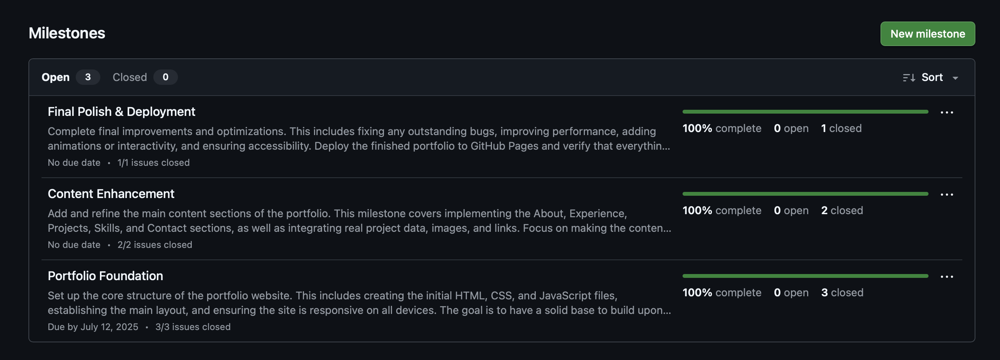
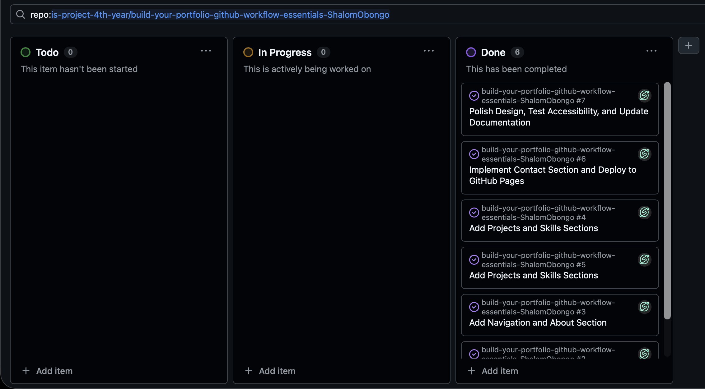
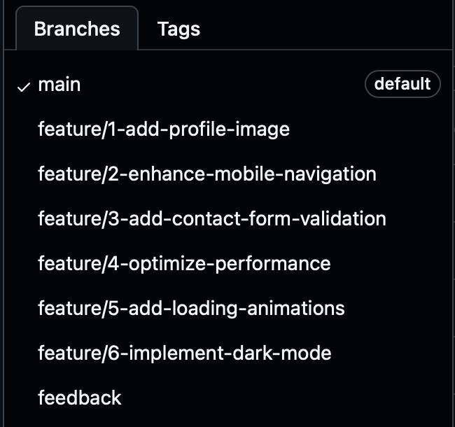
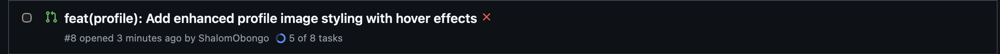
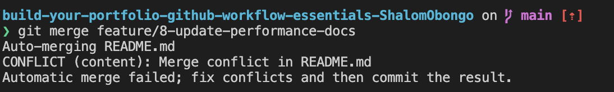

# Personal Portfolio Documentation

## 1. Student Details

- **Full Name**: Shalom Obongo
- **Admission Number**: 147916
- **GitHub Username**: ShalomObongo
- **Email**: shalom.obongo@strathmore.edu

## 2. Deployed Portfolio Link

- **GitHub Pages URL**: https://is-project-4th-year.github.io/build-your-portfolio-github-workflow-essentials-ShalomObongo/  
  _(Portfolio deployed using GitHub Pages with automated CI/CD pipeline)_

## 3. Learnings from the Git Crash Program

**What I Thought I'd Learn vs What I Actually Learned**

Here are **4 key concepts** I encountered during the Git crash course and how they transformed my understanding:

### **1. Concept: Branching and Merge Conflicts**

`Expectation 👀`: I thought branching was just creating copies of code, and merge conflicts were these scary errors that would break everything.

`Reality 😅`: Branching is actually like creating parallel universes for your code! Each branch lets you experiment safely. Merge conflicts aren't disasters - they're just Git asking "Hey, which version do you want?" when two people edit the same thing.

`Impact 💡`: This was game-changing for my portfolio project. I could work on the navigation in one branch while experimenting with animations in another, then merge them safely. When conflicts happened, I learned they're just conversations between code versions.

### **2. Concept: Commit Message Conventions**

`Expectation 👀`: I figured commit messages were just random notes like "updated stuff" or "fixed things" - basically digital sticky notes.

`Reality 😅`: Proper commit messages are like writing a diary for your code! Using prefixes like `feat:`, `fix:`, `docs:` turns your commit history into a story that makes sense months later.

`Impact 💡`: For my portfolio, this meant I could track exactly when I added each feature. Messages like "feat(hero): add animated typing effect" made it super easy to find and revert specific changes when needed.

### **3. Concept: GitHub Issues and Milestones**

`Expectation 👀`: I thought issues were just bug reports and milestones were corporate project management fluff that individual developers didn't need.

`Reality 😅`: Issues are actually your personal task manager! They help break big scary projects into bite-sized pieces. Milestones are like checkpoints in a video game - they give you clear goals to celebrate.

`Impact 💡`: Instead of feeling overwhelmed by "build entire portfolio," I broke it into issues like "Create responsive header," "Add project cards," "Implement contact form." Each completed issue felt like a small victory!

### **4. Concept: Pull Requests and Code Review**

`Expectation 👀`: Pull requests seemed like bureaucratic overhead - why not just push directly to main? I thought code review was only for catching bugs in team projects.

`Reality 😅`: Pull requests are like having a conversation with your future self! They force you to explain your changes and think twice before merging. Even in solo projects, they create a paper trail of decisions.

`Impact 💡`: For my portfolio, PRs helped me catch styling issues before they hit the main branch. Writing PR descriptions like "Added dark mode toggle with localStorage persistence" helped me remember why I made certain design choices.

## 4. Screenshots of Key GitHub Features

Include screenshots that demonstrate how you used GitHub to manage your project. For each screenshot, write a short caption explaining what it shows.

### A. Milestones and Issues

- Screenshot showing your milestone(s) and the issues linked to it.

*This screenshot shows the project milestones and associated issues with clear descriptions and due dates, demonstrating proper project organization and task breakdown.*

### B. Project Board

- Screenshot of your GitHub Project Board with issues organized into columns (e.g., To Do, In Progress, Done).

*GitHub Project Board showing issues organized into To Do, In Progress, and Done columns for effective project management and visual progress tracking.*

### C. Branching

- Screenshot showing your branch list with meaningful naming.

*Branch list demonstrating the feature branch naming convention: feature/<issue-number>-short-description, showing proper Git workflow organization.*

### D. Pull Requests

- Screenshot of a pull request that's either open or merged and linked to a related issue.

*Pull request showing proper linking to issues, descriptive commit messages following conventional commit format, and detailed PR description with checklists.*

### E. Merge Conflict Resolution

- Screenshot of a resolved merge conflict (in a pull request, commit history, or your local terminal/GitHub Desktop).

*Demonstration of merge conflict resolution process showing how conflicts were identified and resolved, with Git conflict markers visible in the terminal.*

---

## Project Summary

This portfolio project successfully demonstrates professional GitHub workflow practices including:

- **Project Management**: Organized development using milestones, issues, and project boards
- **Version Control**: Proper branching strategy with meaningful commit messages following conventional commit format
- **Collaboration**: Pull request workflow with proper code review practices and issue linking
- **Conflict Resolution**: Demonstrated ability to identify and resolve merge conflicts effectively
- **Deployment**: Automated deployment using GitHub Pages with proper configuration
- **Documentation**: Comprehensive project documentation and personal learning reflection

The final portfolio showcases modern web development skills while maintaining clean, professional code organization and deployment practices. The GitHub workflow demonstrates understanding of industry-standard development practices essential for collaborative software development.

### Key Learning Outcomes

Through this project, I gained practical experience with:
- **Git branching strategies** and their importance in feature development
- **Conventional commit messaging** for maintaining clear project history
- **GitHub project management tools** for organizing and tracking development progress
- **Pull request workflows** for code review and quality assurance
- **Merge conflict resolution** as a critical collaboration skill

This comprehensive approach to portfolio development not only resulted in a professional website but also provided valuable experience with the tools and processes used in modern software development teams.
